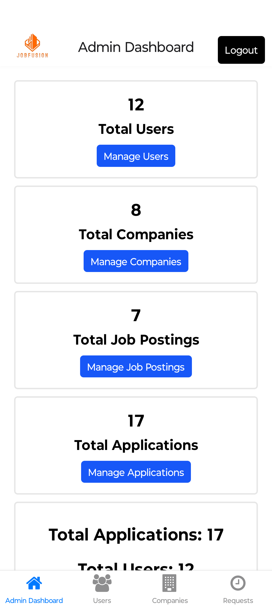

# Job Portal for Campus Placements

An Application to manage placements in your college.

- Contains User, Company and Admin Role Profiles
- User : View and Apply for a Job, View Notifications, Edit Profile
- Company: Post verfication from admin, the company can perfom CRUD of Jobs and Applicants
- Admin: Access of everything

## Tech Stack

- Application: React Native (Expo)
- Backend: NodeJS
- Database: MongoDB
- Cloud Storage Provider: Cloudinary (for files, images storage etc.,)

## Journeys

- User: Register -> Login -> View and Apply Jobs, View Application Statuses, Update Profiles
- Company: Register -> Login -> Verification -> CRUD of Jobs, Manage Applications etc.,
- Admin: Register -> Login -> Access to everything

## Steps to Run the Application

### Application

- Run "cd jobfusion" in terminal
- Run "npm install" in terminal
- Run "npx expo start" in terminal

### Backend

- Run "cd server" in terminal
- Run "npm start" in terminal

## Tech Debt:

- Mobile
- Clean Code (Splitting into components etc.,)
- Implement Auth Middleware
- Fallbacks for certain null fields, placeholders etc.,

## Few Screenshots

### User

#### Login Page

#### Registration Page

#### User Home Page

#### Job Details Page

#### Job Application Page

#### Notifications Page

#### User Profile Page

### Company

#### Company Dashboard Page

#### Company Dashboard More

#### Add Jobs

#### Edit Job

#### Manage Applicants

#### Applicant Detail

#### Company Profile

### Admin

### Admin Dashboard

### Admin Dashboard More

### Admin Users

### Admin Companies

### Admin Jobs

### Company Requests

